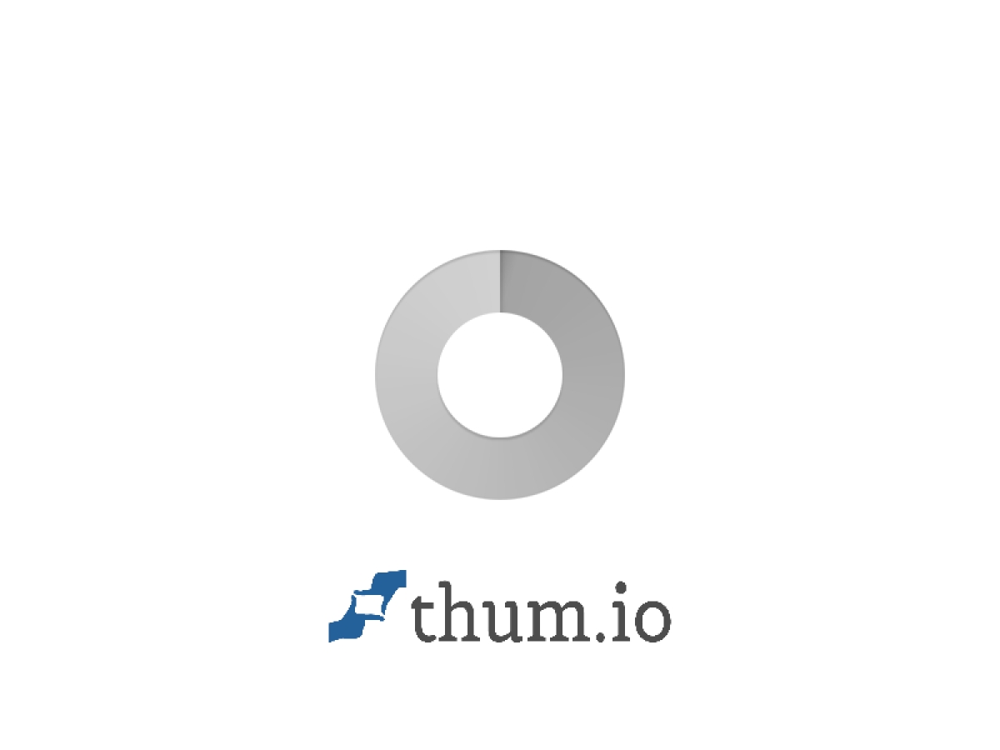

# [aggressor-chess-web](https://outblade.github.io/aggressor-chess-web/)

[](https://opensource.org/licenses/MIT)
[](https://github.com/OutBlade/aggressor-chess-web/stargazers)
[](https://github.com/OutBlade/aggressor-chess-web/network)

[aggressor-chess-web](https://outblade.github.io/aggressor-chess-web/) is a free, web-based chess game with an intelligent AI opponent. Play chess online directly in your browser against a challenging computer opponent with multiple difficulty levels. No installation required.

[](https://outblade.github.io/aggressor-chess-web/)

## Features

- **Complete Chess Rules**: All standard chess rules with full move validation
- **AI Chess Engine**: Intelligent computer opponent using minimax algorithm with alpha-beta pruning
- **Difficulty Levels**: Beginner, Intermediate, Master - suitable for all skill levels
- **Drag & Drop Interface**: Intuitive piece movement with visual feedback
- **Mobile Friendly**: Responsive design optimized for smartphones and tablets
- **Game Analysis**: Real-time position evaluation
- **Save & Load**: Automatic game state management
- **100% Client-Side**: No server required, works offline
- **Free & Open Source**: MIT licensed, no ads, no tracking

## Installation

### Prerequisites
- Modern web browser with JavaScript support (Chrome, Firefox, Safari, Edge)
- Node.js (>= 14.0) for development

### Quick Start

```bash
# Clone the repository
git clone https://github.com/OutBlade/aggressor-chess-web.git
cd aggressor-chess-web

# Install dependencies
npm install

# Start development server
npm run dev
```

### Production Build

```bash
npm run build
```

Deploy the contents of the `public/` directory to any static web server.

## Browser Support

- Chrome 80+
- Firefox 75+
- Safari 13+
- Edge 80+

Older browsers are not supported. Please upgrade for security and performance.

## Technology Stack

- **Frontend**: Vanilla JavaScript ES6+, HTML5 Canvas API, CSS3
- **Chess Engine**: Custom implementation with minimax algorithm
- **AI**: Alpha-beta pruning with position evaluation
- **Build**: Node.js, npm
- **Deployment**: GitHub Pages

## Contributing

We welcome contributions! Please see [CONTRIBUTING.md](CONTRIBUTING.md) for guidelines.

- Fork the repository
- Create a feature branch
- Make your changes
- Submit a pull request

## Code of Conduct

This project follows a [Code of Conduct](CODE_OF_CONDUCT.md). By participating, you are expected to uphold this code.

## Security

For security issues, please see [SECURITY.md](SECURITY.md).

## Credits

Built with passion by [OutBlade](https://github.com/OutBlade)

## Related Projects

- [Lichess](https://lichess.org/) - The free and open source chess server
- [Stockfish](https://stockfishchess.org/) - Strong open-source chess engine
- [Chess.js](https://github.com/jhlywa/chess.js) - JavaScript chess library

## License

This project is licensed under the [MIT License](LICENSE).

## Links

- **Play Online**: [https://outblade.github.io/aggressor-chess-web/](https://outblade.github.io/aggressor-chess-web/)
- **Source Code**: [https://github.com/OutBlade/aggressor-chess-web](https://github.com/OutBlade/aggressor-chess-web)
- **Issue Tracker**: [https://github.com/OutBlade/aggressor-chess-web/issues](https://github.com/OutBlade/aggressor-chess-web/issues)
